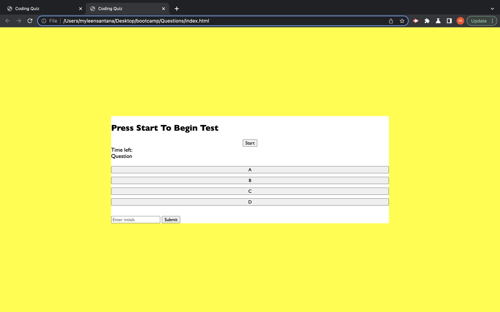

# Coding Quiz

# Descriptions
This Coding Quiz is used to challenge user in Javascript questions. If a user get a question wrong then the time will then decreased by 5 secound until its gameover! Then the score will be tallied of how many question the user got correct. The user will then put ther intials and score in a submition box. 

## Task
- Display time 
- Make Quiz Questions
- Display Quiz Question
- Make sure time dereases by 5 secounds if answered wrong
- "Correct!" should display if answer is Correct.
- At end of gamer user put initals and how many answer they got wrong.

## Deployed Link 

## Screenshot

